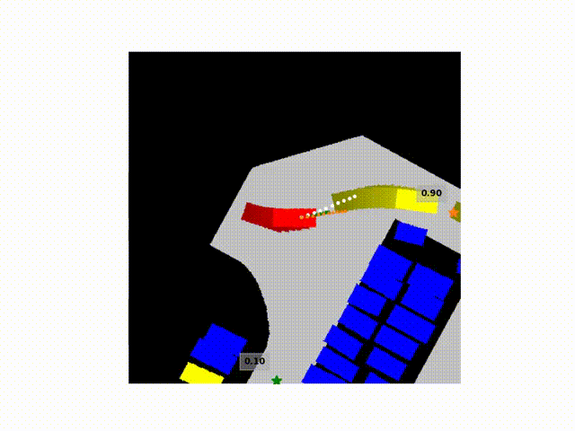
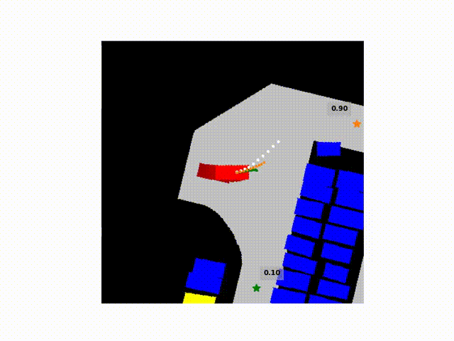

# ParkSim

Vehicle simualtion and behavior prediction in parking lots.

Authors: Xu Shen (xu_shen@berkeley.edu), Alex Wong, Neelay Velingker, Matthew Lacayo, Nidhir Guggilla

## Install
1. Clone this repo
2. In the `/python` folder of this repo, do `pip install -e .` (A virtualenv is recommended)
3. If components of [DLP dataset](https://github.com/MPC-Berkeley/dlp-dataset) is needed, install the DLP package and request data according to the instructions there.
4. If [pytorch](https://pytorch.org/) is needed, please install the correct version based on your OS and hardware.
5. We use [ROS2 Foxy](https://docs.ros.org/en/foxy/index.html) for simulation. You would need that installed if you want to run vehicle simulation.

## [ParkPredict+](https://arxiv.org/abs/2204.10777)

ParkPredict+: Multimodal Intent and Motion Prediction for Vehicles in Parking Lots with CNN and Transformer

Authors: Xu Shen, Matthew Lacayo, Nidhir Guggilla, Francesco Borrelli

> **Note**: You don't need ROS for ParkPredict+.

  
  

### Usage
See [this document](https://github.com/XuShenLZ/ParkSim/tree/main/python/parksim/trajectory_predict) for instruction.
1. A pre-trained intent prediction model can be [downloaded here](https://drive.google.com/file/d/1LVQJRQmjGfGchxhMRchiZRCjrlFDVch-/view?usp=sharing).
2. A pre-trained trajectory prediction model can be [downloaded here](https://drive.google.com/file/d/1c9KQXwFMRIYPJo1sXJKepoBcrEme_HxU/view?usp=sharing).
